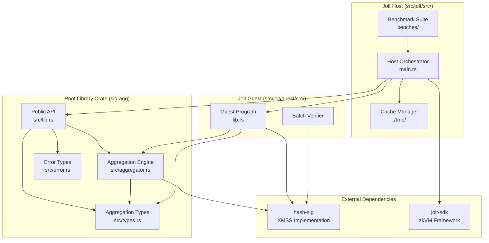
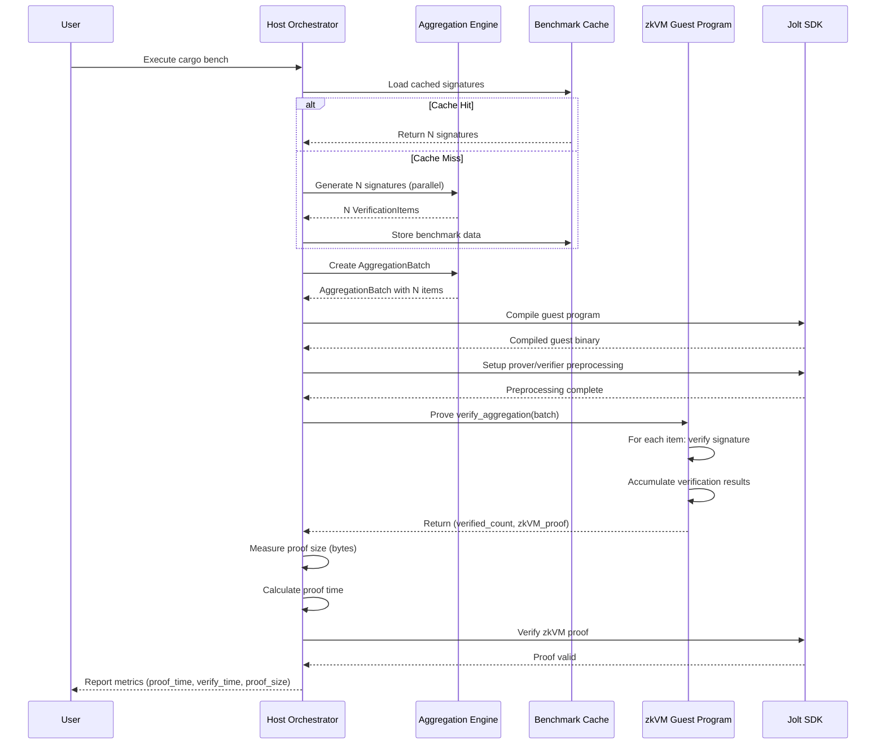
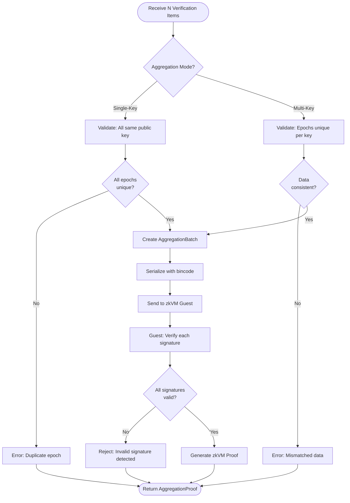
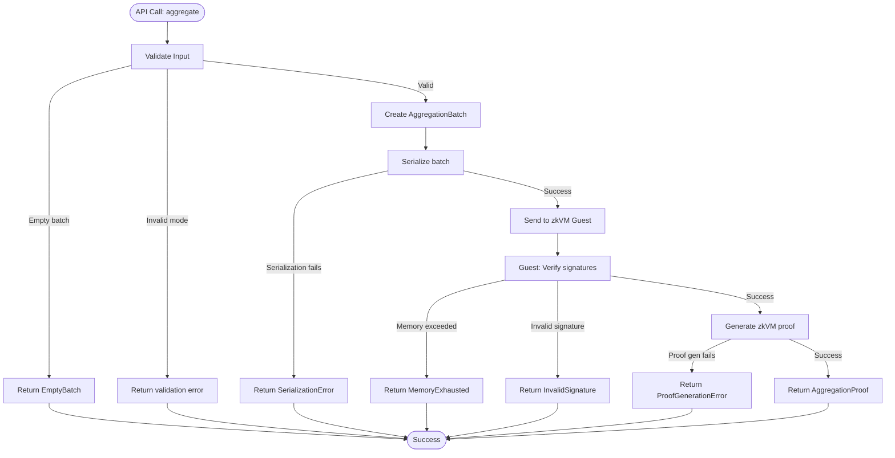

# Technical Design: Jolt-Provable Aggregation

## Overview

**Purpose**: This feature delivers a signature aggregation system that enables efficient batch verification of XMSS signatures through zero-knowledge proofs, reducing verification overhead and proof size for post-quantum cryptographic applications.

**Users**: Cryptographic application developers and zero-knowledge system builders will utilize this for scalable signature verification in blockchain applications, secure multi-party computation, and other systems requiring efficient batch processing of post-quantum signatures.

**Impact**: Transforms the current empty `sig-agg` library into a functional aggregation system and extends the existing Jolt benchmark infrastructure to support aggregated signature proof generation, verification, and performance measurement. The system enables verifying N signatures through a single compact zkVM proof rather than N individual verification operations.

### Goals

- Implement XMSS signature aggregation using zkVM-based succinct arguments
- Provide O(N) or better aggregation algorithm with measurable space savings
- Support both single-key batch aggregation and multi-key aggregation modes
- Enable efficient zkVM-based verification within Jolt's memory and trace constraints
- Deliver comprehensive benchmarking infrastructure via `cargo bench` for proof metrics
- Maintain post-quantum security properties of underlying XMSS signatures

### Non-Goals

- Cryptographic signature aggregation schemes (BLS-style) - XMSS cannot be cryptographically aggregated
- Privacy-preserving features or zero-knowledge privacy guarantees
- Support for hash-based signature schemes other than XMSS with Poseidon
- Distributed aggregation across multiple nodes or services
- Real-time streaming aggregation - batch processing only

## Architecture

### Existing Architecture Analysis

The project currently consists of two workspaces:

**Root Workspace** (`sig-agg` crate):
- Currently empty `src/lib.rs` awaiting aggregation implementation
- Rust edition 2024 with strict linting configuration
- Intended to expose aggregation primitives as a reusable library

**Jolt Benchmark Workspace** (`src/jolt/`):
- Host-guest architecture for zkVM execution
- Host (`src/jolt/src/main.rs`): Orchestrates signature generation, guest compilation, proof generation/verification
- Guest (`src/jolt/guest/src/lib.rs`): Contains `#[jolt::provable]` function for signature verification
- Currently verifies 1000 individual XMSS signatures sequentially
- Uses `VerificationBatch` and `VerificationItem` types for zkVM I/O
- Caches benchmark data in `./tmp/benchmark_data.bin`

**Integration Points to Maintain**:
- Jolt SDK API for guest program compilation and proof generation
- hash-sig library's `SignatureScheme` trait interface
- Existing serialization infrastructure (bincode/serde)
- Cache management for benchmark data
- Release build configuration for performance

### High-Level Architecture



**Architecture Integration**:
- **Existing patterns preserved**: Host-guest separation, cache-first data loading, parallel signature generation with rayon
- **New components rationale**:
  - `Aggregator` provides core batch verification logic reusable in host and guest
  - `AggregationProof` type represents the zkVM proof as the "aggregated signature"
  - Benchmark suite measures aggregation-specific metrics required by Requirement 4
- **Technology alignment**: Uses existing Rust 2024/2021 editions, hash-sig Poseidon XMSS, Jolt SDK, serde/bincode stack
- **Steering compliance**: Follows structure.md patterns (workspace separation, strict linting), tech.md configurations (rayon parallelism, release optimizations), product.md goals (post-quantum + zkVM efficiency)

### Technology Stack and Design Decisions

**Technology Alignment**: Extends existing technology stack with minimal new dependencies.

**Existing Stack (Preserved)**:
- **Language**: Rust (edition 2024 for library, 2021 for Jolt workspace)
- **zkVM Framework**: Jolt SDK with host-guest model
- **Cryptography**: hash-sig library with Poseidon-based XMSS (`SIGWinternitzLifetime18W1`)
- **Parallelism**: rayon for host-side parallel processing
- **Serialization**: serde + bincode for zkVM I/O and caching
- **Build System**: Cargo with workspace configuration

**New Dependencies Introduced**:
- **criterion** (dev-dependency): Industry-standard Rust benchmarking framework for `cargo bench` support
  - Rationale: Requirements 4.6-4.9 mandate detailed performance metrics (proof time, verification time, proof size)
  - Alternative considered: Manual benchmarking in main.rs, but criterion provides statistical analysis and standardized output format
- **Potential**: **bincode-size** or manual serialization metrics for proof size measurement

**Key Design Decisions**:

#### Decision 1: zkVM-Based Aggregation via Succinct Arguments

**Decision**: Implement aggregation through zkVM proofs rather than cryptographic signature aggregation.

**Context**: XMSS is a hash-based signature scheme that does not support cryptographic aggregation (like BLS signatures). The requirement is to "aggregate" N signatures into a more compact verifiable proof.

**Alternatives**:
1. **Merkle tree accumulation**: Combine signature authentication paths to reduce redundancy
2. **Cryptographic multi-signatures**: Research-stage post-quantum multi-signature schemes
3. **zkVM succinct arguments** (selected): Use Jolt zkVM to generate a proof that N signatures verify correctly

**Selected Approach**:
- Host prepares N XMSS signatures with verification data
- Guest program verifies all N signatures and returns success count
- Jolt zkVM generates a succinct proof π demonstrating correct verification
- Verifier checks zkVM proof π instead of N individual signatures

**Rationale**:
- XMSS structure prevents traditional cryptographic aggregation
- zkVM proof size is independent of N (constant or log(N) growth)
- Verification of zkVM proof is constant time regardless of N
- Aligns with existing Jolt infrastructure and hash-sig library

**Trade-offs**:
- **Gain**: Constant-time verification, significant space savings for large N, proven security
- **Sacrifice**: Higher proof generation cost (zkVM overhead), requires zkVM infrastructure, larger proof for small N (<10 signatures)

#### Decision 2: Batch Verification in Guest vs. Pre-Aggregation in Host

**Decision**: Perform full batch verification inside the zkVM guest rather than pre-aggregating authentication paths in the host.

**Context**: Two possible approaches for reducing computational work: (1) pre-compute shared Merkle paths in host, or (2) verify each signature independently in guest.

**Alternatives**:
1. **Host-side pre-aggregation**: Analyze XMSS signatures to identify shared authentication paths, send compressed data to guest
2. **Guest-side full verification** (selected): Send complete verification data to guest, verify each signature independently using hash-sig primitives
3. **Hybrid approach**: Partial pre-computation in host with final verification in guest

**Selected Approach**:
Guest receives `AggregationBatch` containing N complete verification items (public key, message, epoch, signature) and verifies each using `hash-sig::SignatureScheme::verify()` in a loop, accumulating results.

**Rationale**:
- Simplicity: Reuses existing hash-sig verification logic without modification
- Correctness: Each signature is independently verified per XMSS security model
- Maintainability: Changes to hash-sig library automatically propagate
- Memory efficiency: Sequential verification has predictable memory usage within zkVM constraints
- Compatibility: Works identically for single-key and multi-key aggregation modes

**Trade-offs**:
- **Gain**: Implementation simplicity, guaranteed correctness, maintainability, clear security analysis
- **Sacrifice**: Higher computational cost in guest (O(N) independent verifications), larger zkVM trace length for large N

#### Decision 3: Criterion-Based Benchmarking Infrastructure

**Decision**: Use Criterion.rs framework for `cargo bench` implementation rather than custom benchmarking.

**Context**: Requirements 4.6-4.9 mandate measuring proof generation time, verification time, and proof size for various batch sizes (N=100, 500, 1000).

**Alternatives**:
1. **Manual timing in main.rs**: Extend existing `Instant::now()` timing code
2. **Criterion.rs** (selected): Industry-standard Rust benchmarking framework
3. **Custom benchmark harness**: Write specialized benchmarking infrastructure

**Selected Approach**:
Create `benches/aggregation.rs` using Criterion to benchmark:
- `prove_aggregation/N` - proof generation for N signatures
- `verify_aggregation/N` - proof verification for N signatures
- Report custom metrics: proof size in bytes via `Criterion::measurement_time()`

**Rationale**:
- Standard tool: Widely adopted in Rust ecosystem with excellent documentation
- Statistical rigor: Automatic outlier detection, confidence intervals, warmup handling
- Multiple batch sizes: Built-in parameterization for N=100, 500, 1000
- HTML reports: Generates visualizations of performance trends
- CI integration: Easily incorporated into continuous integration

**Trade-offs**:
- **Gain**: Professional benchmarking with statistical analysis, standard output format, extensibility
- **Sacrifice**: Additional dependency, learning curve for configuration, potentially slower than raw timing

## System Flows

### Aggregation Proof Generation Flow



### Multi-Key vs Single-Key Aggregation Flow



## Requirements Traceability

| Requirement | Summary | Components | Interfaces | Flows |
|-------------|---------|------------|------------|-------|
| 1.1 | Produce aggregated proof from signatures | `Aggregator`, `zkVM Guest` | `aggregate()`, `verify_aggregation()` | Aggregation Proof Generation |
| 1.2 | Multi-key aggregation support | `Aggregator::validate_multi_key()` | `AggregationMode::MultiKey` | Multi-Key Aggregation Flow |
| 1.3 | Single-key batch aggregation | `Aggregator::validate_single_key()` | `AggregationMode::SingleKey` | Single-Key Aggregation Flow |
| 1.4 | Verify all N signatures valid | `zkVM Guest::verify_aggregation()` | Returns `verified_count` | Guest verification loop |
| 1.5 | Reject if any signature invalid | `zkVM Guest` validation logic | Proof generation fails | CheckAllValid decision |
| 1.6 | hash-sig Poseidon compatibility | Direct use of `SignatureScheme` trait | `hash-sig` API calls | All verification paths |
| 2.1 | Guest verifies using hash-sig | `zkVM Guest` | `SIGWinternitzLifetime18W1::verify()` | Guest verification loop |
| 2.2 | Serializable data structures | `AggregationBatch`, `AggregationProof` | `#[derive(Serialize, Deserialize)]` | SerializeBatch |
| 2.3 | Guest returns verification result | `zkVM Guest::verify_aggregation()` | Returns `(u32, zkVM_proof)` | Return verified_count |
| 2.4 | Appropriate memory configuration | `#[jolt::provable]` attributes | `memory_size`, `max_trace_length` | Jolt compilation |
| 2.5 | Operate within memory limits | Memory-efficient sequential verification | O(1) space per iteration | Guest verification loop |
| 2.6 | Host verifies zkVM proof | `Host` orchestrator | `verify_verify_aggregation()` | Proof verification |
| 3.1 | Public API in src/lib.rs | `pub mod aggregator`, `pub mod types` | `pub fn aggregate()`, `pub fn verify()` | Library exports |
| 3.2 | Function accepting verification items | `Aggregator::aggregate()` | `Vec<VerificationItem>` → `AggregationProof` | CreateBatch |
| 3.3 | Verification function | `Aggregator::verify()` | `AggregationProof` → `bool` | Host verification |
| 3.4 | Descriptive error types | `AggregationError` enum | `Result<T, AggregationError>` | All error paths |
| 3.5 | Rust naming conventions | All types and functions | snake_case/CamelCase | Codebase-wide |
| 3.6 | std/no_std support | Conditional compilation | `#[cfg(feature = "std")]` | Guest vs Host builds |
| 3.7 | Derive appropriate traits | `AggregationBatch`, `AggregationProof` | `Debug, Clone, Serialize, Deserialize` | Type definitions |
| 4.1 | Complexity better than O(N²) | Sequential verification | O(N) time complexity | Guest verification loop |
| 4.2 | Complete within trace limits | Configured `max_trace_length` | 65536 for 1000 signatures | zkVM constraints |
| 4.3 | Measurable space savings | Proof size measurement | Constant proof size vs N*signature_size | Benchmark comparison |
| 4.4 | Parallel processing with rayon | Host signature generation | `rayon::par_iter()` | Signature generation |
| 4.5 | Memory-efficient guest algorithm | Sequential verification | O(1) memory per iteration | Guest implementation |
| 4.6-4.8 | cargo bench metrics | `benches/aggregation.rs` | Criterion benchmarks | Benchmarking infrastructure |
| 4.9 | Various batch sizes | Parameterized benchmarks | N ∈ {100, 500, 1000} | Criterion configuration |
| 4.10 | Compare aggregated vs individual | Baseline benchmarks | Separate benchmark groups | Performance comparison |
| 5.1 | Reject forgeries | zkVM soundness property | Cryptographic proof system | Jolt verification |
| 5.2 | Detect invalid signatures | Per-signature verification | `SignatureScheme::verify()` | Guest validation |
| 5.3 | Enforce consistency checks | `validate_single_key()`, `validate_multi_key()` | Pre-aggregation validation | Validation flows |
| 5.4 | Consistent cryptographic assumptions | hash-sig + Jolt security | No additional assumptions | Architecture decision |
| 5.5 | Maintain post-quantum properties | XMSS security model preserved | Direct signature verification | Security analysis |
| 5.6 | Cryptographically secure RNG | `rand::rng()` for signature generation | Per-thread RNG | Host signature generation |
| 6.1 | Unit tests for aggregation/verification | `src/lib.rs` tests | `#[cfg(test)] mod tests` | Test modules |
| 6.2 | Integration tests with Jolt | `src/jolt/src/main.rs` tests | End-to-end test functions | Integration test suite |
| 6.3 | Error handling tests | Unit tests for error cases | Invalid input test vectors | Error test cases |
| 6.4 | Performance comparison benchmarks | Criterion benchmarks | Aggregated vs baseline | Benchmark suite |
| 6.5 | hash-sig test vector compatibility | Unit tests | Known test vectors | Compatibility tests |
| 6.6 | Both cargo test commands pass | CI configuration | Root and Jolt workspace tests | Test execution |
| 7.1 | Rust doc comments | `///` documentation | All public functions | Documentation |
| 7.2 | Code examples | `examples/` directory | Standalone example files | Example programs |
| 7.3 | Document limitations | README and doc comments | Constraint documentation | Documentation |
| 7.4 | Explanatory benchmark output | println! messages in benches | User-facing messages | Benchmark execution |
| 7.5 | Explain host vs guest differences | API documentation | Conditional compilation docs | Documentation |

## Components and Interfaces

### Aggregation Library Domain

#### Aggregation Engine

**Responsibility & Boundaries**
- **Primary Responsibility**: Orchestrates the aggregation of multiple XMSS signatures into a zkVM-based proof structure
- **Domain Boundary**: Signature aggregation domain - owns aggregation logic, validation, and proof structure creation
- **Data Ownership**: Manages `AggregationBatch` construction and validation state
- **Transaction Boundary**: Atomic aggregation operation - either all signatures are aggregated or the operation fails

**Dependencies**
- **Inbound**: Host orchestrator (`src/jolt/src/main.rs`), benchmark suite (`benches/aggregation.rs`)
- **Outbound**: hash-sig library (`SignatureScheme` trait), type definitions (`src/types.rs`), error types (`src/error.rs`)
- **External**: hash-sig library (https://github.com/b-wagn/hash-sig) for XMSS signature verification

**Contract Definition**

**Service Interface**:
```rust
/// Aggregation engine for XMSS signature batches
pub struct Aggregator;

impl Aggregator {
    /// Aggregate multiple XMSS signatures into a batch structure
    ///
    /// # Arguments
    /// * `items` - Collection of verification items (message, epoch, signature, public key)
    /// * `mode` - Aggregation mode (SingleKey or MultiKey)
    ///
    /// # Returns
    /// * `Ok(AggregationBatch)` - Validated batch ready for zkVM processing
    /// * `Err(AggregationError)` - Validation failure with specific error context
    pub fn aggregate(
        items: Vec<VerificationItem>,
        mode: AggregationMode,
    ) -> Result<AggregationBatch, AggregationError>;

    /// Verify an aggregation proof (host-side verification of zkVM proof)
    ///
    /// # Arguments
    /// * `proof` - The aggregation proof returned from zkVM guest
    /// * `original_batch` - Original batch data for comparison
    ///
    /// # Returns
    /// * `Ok(bool)` - Proof is valid (true) or invalid (false)
    /// * `Err(AggregationError)` - Verification process error
    pub fn verify(
        proof: &AggregationProof,
        original_batch: &AggregationBatch,
    ) -> Result<bool, AggregationError>;

    /// Validate single-key batch aggregation constraints
    fn validate_single_key(items: &[VerificationItem]) -> Result<(), AggregationError>;

    /// Validate multi-key aggregation constraints
    fn validate_multi_key(items: &[VerificationItem]) -> Result<(), AggregationError>;
}
```

**Preconditions**:
- `items` must be non-empty (minimum 1 signature)
- All `VerificationItem` fields must be valid (non-zero public keys, valid signatures)
- For `SingleKey` mode: all items must share the same public key
- For `MultiKey` mode: each (public_key, epoch) pair must be unique

**Postconditions**:
- On success: Returns validated `AggregationBatch` with all items in insertion order
- On failure: Returns specific `AggregationError` indicating validation failure reason
- No side effects - pure function (no state mutation)

**Invariants**:
- Aggregation operation does not modify input `items`
- Batch size equals input size (no items added or removed)
- For `SingleKey`: `batch.public_key` matches all items
- For `MultiKey`: no duplicate (public_key, epoch) combinations

**State Management**: Stateless component - no persistent state between invocations.

#### zkVM Guest Verifier

**Responsibility & Boundaries**
- **Primary Responsibility**: Verifies all signatures in an `AggregationBatch` within the Jolt zkVM guest environment
- **Domain Boundary**: zkVM execution domain - operates under constrained memory and no_std environment
- **Data Ownership**: Receives batch data via zkVM I/O, does not persist state
- **Transaction Boundary**: Single proof generation - all verifications occur within one zkVM execution

**Dependencies**
- **Inbound**: Jolt host orchestrator via zkVM I/O mechanism
- **Outbound**: hash-sig library (`SignatureScheme::verify`), aggregation types (`AggregationBatch`)
- **External**: Jolt SDK guest runtime, hash-sig library

**Contract Definition**

**zkVM Entry Point**:
```rust
/// zkVM guest function that verifies an aggregation batch
///
/// Memory configuration:
/// - memory_size: 10240 (10 MB)
/// - max_trace_length: 65536 (configurable based on batch size)
///
/// # Arguments
/// * `batch` - Aggregation batch containing signatures to verify
///
/// # Returns
/// * Verified signature count (should equal batch.items.len() for success)
#[jolt::provable(memory_size = 10240, max_trace_length = 65536)]
fn verify_aggregation(batch: AggregationBatch) -> u32 {
    let mut verified_count: u32 = 0;

    for item in batch.items {
        let is_valid = match batch.mode {
            AggregationMode::SingleKey => {
                // Single key: use shared public key
                SIGWinternitzLifetime18W1::verify(
                    &batch.public_key.expect("SingleKey mode requires public_key"),
                    item.epoch,
                    &item.message,
                    &item.signature,
                )
            }
            AggregationMode::MultiKey => {
                // Multi-key: use item-specific public key
                SIGWinternitzLifetime18W1::verify(
                    &item.public_key.expect("MultiKey mode requires per-item public_key"),
                    item.epoch,
                    &item.message,
                    &item.signature,
                )
            }
        };

        if is_valid {
            verified_count += 1;
        }
    }

    verified_count
}
```

**Preconditions**:
- `batch` is properly serialized and deserialized by Jolt I/O
- Batch size does not exceed memory configuration limits
- Execution trace length stays within `max_trace_length`

**Postconditions**:
- Returns count of successfully verified signatures (0 to N)
- If count < N, indicates at least one signature is invalid
- zkVM proof is generated if execution completes successfully

**Invariants**:
- Memory usage remains within configured `memory_size`
- No heap allocations beyond batch data structure
- Deterministic execution (same input → same output)

**State Management**: Stateless function - no persistent guest state between zkVM invocations.

#### Benchmark Suite

**Responsibility & Boundaries**
- **Primary Responsibility**: Measures and reports proof generation time, verification time, and proof size for various batch sizes
- **Domain Boundary**: Performance measurement domain - benchmarks aggregation operations
- **Data Ownership**: Generates or loads benchmark data, owns timing measurements
- **Transaction Boundary**: Independent benchmark runs for each batch size

**Dependencies**
- **Inbound**: Invoked by `cargo bench` command
- **Outbound**: Aggregation Engine, Jolt host orchestrator, hash-sig library
- **External**: Criterion.rs benchmarking framework

**Contract Definition**

**Benchmark Interface**:
```rust
// benches/aggregation.rs

use criterion::{criterion_group, criterion_main, Criterion, BenchmarkId};

/// Benchmark proof generation for N aggregated signatures
fn bench_proof_generation(c: &mut Criterion) {
    let mut group = c.benchmark_group("aggregation_prove");

    for batch_size in [100, 500, 1000].iter() {
        group.bench_with_input(
            BenchmarkId::from_parameter(batch_size),
            batch_size,
            |b, &size| {
                // Setup: Generate or load N signatures
                let batch = setup_benchmark_batch(size);

                // Measure: Proof generation time
                b.iter(|| {
                    let (verified_count, proof, _io) = prove_verify_aggregation(batch.clone());
                    assert_eq!(verified_count, size);
                    proof
                });
            },
        );
    }

    group.finish();
}

/// Benchmark proof verification for N aggregated signatures
fn bench_proof_verification(c: &mut Criterion) {
    let mut group = c.benchmark_group("aggregation_verify");

    for batch_size in [100, 500, 1000].iter() {
        // Setup: Pre-generate proof
        let batch = setup_benchmark_batch(*batch_size);
        let (verified_count, proof, program_io) = prove_verify_aggregation(batch.clone());

        group.bench_with_input(
            BenchmarkId::from_parameter(batch_size),
            batch_size,
            |b, _| {
                // Measure: Verification time
                b.iter(|| {
                    verify_verify_aggregation(
                        batch.clone(),
                        verified_count,
                        program_io.panic,
                        proof.clone(),
                    )
                });
            },
        );
    }

    group.finish();
}

/// Measure and report proof size for N aggregated signatures
fn bench_proof_size(c: &mut Criterion) {
    let mut group = c.benchmark_group("aggregation_proof_size");

    for batch_size in [100, 500, 1000].iter() {
        let batch = setup_benchmark_batch(*batch_size);
        let (_, proof, _) = prove_verify_aggregation(batch);

        // Serialize proof to measure size
        let proof_bytes = bincode::serialize(&proof).expect("Serialization failed");
        let proof_size = proof_bytes.len();

        println!("Proof size for {} signatures: {} bytes", batch_size, proof_size);

        // Report as throughput metric (bytes per operation)
        group.throughput(criterion::Throughput::Bytes(proof_size as u64));
        group.bench_with_input(
            BenchmarkId::from_parameter(batch_size),
            batch_size,
            |b, _| {
                b.iter(|| proof_size);
            },
        );
    }

    group.finish();
}

criterion_group!(benches, bench_proof_generation, bench_proof_verification, bench_proof_size);
criterion_main!(benches);
```

**Preconditions**:
- Benchmark data cache is accessible (`./tmp/` directory exists)
- Jolt guest program is compilable
- System has sufficient resources for zkVM proof generation

**Postconditions**:
- Criterion generates statistical analysis report (HTML + terminal)
- Prints custom proof size metrics to stdout
- All benchmark runs complete without errors

**Invariants**:
- Benchmark setup does not interfere with measurements (excluded from timing)
- Same batch sizes are used consistently (100, 500, 1000)
- Proof generation always precedes verification measurement

## Data Models

### Domain Model

**Core Concepts**:

**Aggregates**:
- `AggregationBatch`: Transactional consistency boundary for a set of signatures to be aggregated. Once created, the batch is immutable and represents a single atomic aggregation operation.

**Entities**:
- `VerificationItem`: Represents a single XMSS signature with its verification context (message, epoch, signature, optional public key). Identity is defined by (public_key, epoch) combination.

**Value Objects**:
- `AggregationMode`: Immutable enumeration describing aggregation semantics (SingleKey vs MultiKey).
- `AggregationProof`: Immutable zkVM proof structure representing the verified batch. Contains the Jolt proof bytes and metadata.

**Domain Events**:
- `BatchAggregated`: Signifies successful creation of `AggregationBatch` after validation
- `ProofGenerated`: Signifies zkVM proof generation completed successfully
- `ProofVerified`: Signifies zkVM proof verification completed successfully

**Business Rules & Invariants**:
- **SingleKey Constraint**: All signatures in batch must share the same public key, and epochs must be unique
- **MultiKey Constraint**: Each (public_key, epoch) pair must be unique across the batch
- **Minimum Batch Size**: At least 1 signature required for aggregation
- **Maximum Batch Size**: Limited by zkVM memory configuration (currently ~1000 signatures for 10 MB)
- **Epoch Uniqueness**: Each epoch can be used at most once per public key (XMSS security requirement)

### Logical Data Model

**Structure Definition**:

```rust
/// Represents a single XMSS signature with verification context
#[derive(Debug, Clone, Serialize, Deserialize)]
pub struct VerificationItem {
    /// Message that was signed (fixed length from hash-sig)
    pub message: [u8; MESSAGE_LENGTH],

    /// Epoch (time period) when signature was created
    pub epoch: u32,

    /// XMSS signature data
    pub signature: <SIGWinternitzLifetime18W1 as SignatureScheme>::Signature,

    /// Public key (optional - required for MultiKey mode, None for SingleKey)
    pub public_key: Option<<SIGWinternitzLifetime18W1 as SignatureScheme>::PublicKey>,
}

/// Aggregation mode determining validation and verification logic
#[derive(Debug, Clone, Copy, PartialEq, Eq, Serialize, Deserialize)]
pub enum AggregationMode {
    /// All signatures share the same public key
    SingleKey,

    /// Signatures may have different public keys
    MultiKey,
}

/// Batch of signatures ready for aggregation
#[derive(Debug, Clone, Serialize, Deserialize)]
pub struct AggregationBatch {
    /// Aggregation mode for this batch
    pub mode: AggregationMode,

    /// Shared public key (SingleKey mode only)
    pub public_key: Option<<SIGWinternitzLifetime18W1 as SignatureScheme>::PublicKey>,

    /// Collection of verification items
    pub items: Vec<VerificationItem>,
}

/// Aggregation proof (zkVM proof + metadata)
#[derive(Debug, Clone, Serialize, Deserialize)]
pub struct AggregationProof {
    /// Jolt zkVM proof bytes
    pub proof: Vec<u8>,

    /// Number of signatures verified in the proof
    pub verified_count: u32,

    /// Batch mode used during aggregation
    pub mode: AggregationMode,

    /// Proof generation metadata (optional, for diagnostics)
    pub metadata: ProofMetadata,
}

/// Metadata about proof generation
#[derive(Debug, Clone, Serialize, Deserialize)]
pub struct ProofMetadata {
    /// Timestamp when proof was generated
    pub timestamp: u64,

    /// Batch size (number of signatures)
    pub batch_size: usize,

    /// zkVM configuration used
    pub memory_size: usize,
    pub trace_length: usize,
}
```

**Entity Relationships and Cardinality**:
- `AggregationBatch` 1 --- * `VerificationItem`: One batch contains multiple items
- `AggregationBatch` * --- 1 `AggregationMode`: Each batch has exactly one mode
- `AggregationProof` 1 --- 1 `AggregationBatch`: Each proof corresponds to exactly one batch (implicit via verified_count and mode)

**Natural Keys and Identifiers**:
- `VerificationItem`: Natural key is (public_key, epoch) combination
- `AggregationBatch`: No persistent identifier - ephemeral structure for aggregation operation
- `AggregationProof`: Identified by proof bytes (cryptographic commitment)

**Referential Integrity Rules**:
- `VerificationItem.public_key`: Must be Some for MultiKey mode, None for SingleKey mode
- `AggregationBatch.public_key`: Must be Some for SingleKey mode, None for MultiKey mode
- `AggregationBatch.items`: Must be non-empty (minimum 1 item)

**Consistency & Integrity**:
- **Transaction boundaries**: Batch creation and validation is atomic - either succeeds completely or fails
- **Cascading rules**: Not applicable (no persistent storage or database)
- **Temporal aspects**: `ProofMetadata.timestamp` records proof generation time for audit purposes

### Data Contracts & Integration

**API Data Transfer**:

```rust
// Public API request/response types

/// Request to aggregate signatures
pub struct AggregationRequest {
    pub items: Vec<VerificationItem>,
    pub mode: AggregationMode,
}

/// Response from aggregation operation
pub struct AggregationResponse {
    pub proof: AggregationProof,
    pub batch_size: usize,
}

/// Request to verify aggregation proof
pub struct VerificationRequest {
    pub proof: AggregationProof,
    pub original_batch: AggregationBatch,
}

/// Response from verification operation
pub struct VerificationResponse {
    pub is_valid: bool,
    pub verified_count: u32,
}
```

**Serialization Format**: bincode (binary format) for zkVM I/O and caching.

**Schema Versioning Strategy**:
- Semantic versioning for the library crate
- Breaking changes to data structures require major version bump
- Forward compatibility through optional fields with serde defaults

**Backward/Forward Compatibility Rules**:
- Adding new optional fields: Backward compatible (use `#[serde(default)]`)
- Removing fields: Breaking change requiring major version bump
- Changing field types: Breaking change
- Adding new enum variants: Potentially breaking (use `#[non_exhaustive]` attribute)

**Cross-Service Data Management**:
- Not applicable - single-process library without distributed transactions
- Eventual consistency: Not applicable - synchronous API

## Error Handling

### Error Strategy

The aggregation system uses Rust's `Result<T, E>` pattern for explicit error handling. All public API functions return `Result` types with descriptive error enums. The system distinguishes between:

1. **User Errors**: Invalid input, misconfiguration, constraint violations → Return error to caller with actionable message
2. **System Errors**: zkVM failures, memory exhaustion, serialization errors → Propagate error with context
3. **Cryptographic Errors**: Invalid signatures, verification failures → Return error with security implications documented

### Error Categories and Responses

**User Errors (Validation Failures)**:

```rust
#[derive(Debug, Clone, PartialEq, Eq)]
pub enum AggregationError {
    /// Empty batch provided
    EmptyBatch,

    /// Duplicate epoch in SingleKey mode
    DuplicateEpoch { epoch: u32 },

    /// Mismatched public keys in SingleKey mode
    MismatchedPublicKey { expected: String, found: String },

    /// Duplicate (public_key, epoch) pair in MultiKey mode
    DuplicateKeyEpochPair { public_key: String, epoch: u32 },

    /// Missing public key field when required
    MissingPublicKey { mode: AggregationMode },

    /// Batch size exceeds zkVM memory limits
    BatchTooLarge { size: usize, max: usize },
}
```

**Response**: Return error to caller with field-level context. User can inspect error and correct input.

**System Errors (Infrastructure Failures)**:

```rust
#[derive(Debug)]
pub enum AggregationError {
    /// Serialization failed
    SerializationError { source: bincode::Error },

    /// zkVM compilation failed
    CompilationError { message: String },

    /// zkVM proof generation failed
    ProofGenerationError { message: String },

    /// zkVM proof verification failed
    ProofVerificationError { message: String },

    /// Memory limit exceeded during execution
    MemoryExhausted { used: usize, limit: usize },
}
```

**Response**: Propagate error up the call stack. Host orchestrator logs error and may retry with smaller batch size. For memory exhaustion, graceful degradation by reducing batch size.

**Business Logic Errors (Cryptographic Failures)**:

```rust
#[derive(Debug, Clone, PartialEq, Eq)]
pub enum AggregationError {
    /// One or more signatures failed verification
    InvalidSignature { index: usize },

    /// Verified count does not match expected count
    VerificationMismatch { expected: usize, actual: usize },

    /// zkVM proof is cryptographically invalid
    InvalidProof,
}
```

**Response**: Return error with specific index of invalid signature. Security-sensitive operations fail fast without exposing sensitive information.

**Error Flow Visualization**:



### Monitoring

**Error Tracking**:
- All errors implement `std::error::Error` trait for standard error handling
- Errors include context information (indices, counts, limits) for debugging
- Critical errors (proof generation failures) should be logged with full stack trace

**Logging**:
- Use `log` crate for structured logging at appropriate levels:
  - `error!`: Proof generation/verification failures, system errors
  - `warn!`: Validation failures, large batch sizes approaching limits
  - `info!`: Successful aggregation operations, batch sizes
  - `debug!`: Detailed validation steps, serialization events
  - `trace!`: Per-signature verification results

**Health Monitoring**:
- Track aggregation success rate: `successful_aggregations / total_aggregations`
- Monitor average batch size and proof generation time
- Alert on repeated proof generation failures (may indicate zkVM configuration issues)
- Track memory usage trends to identify potential exhaustion risks

## Testing Strategy

### Unit Tests

**Aggregation Engine (src/aggregator.rs)**:
1. `test_aggregate_single_key_valid` - Successfully aggregate N signatures with same public key
2. `test_aggregate_multi_key_valid` - Successfully aggregate N signatures with different public keys
3. `test_aggregate_empty_batch_error` - Reject empty batch with EmptyBatch error
4. `test_aggregate_duplicate_epoch_error` - Detect duplicate epochs in SingleKey mode
5. `test_aggregate_mismatched_keys_error` - Detect mismatched public keys in SingleKey mode

**Data Model (src/types.rs)**:
1. `test_verification_item_serde` - Serialize/deserialize VerificationItem correctly
2. `test_aggregation_batch_serde` - Serialize/deserialize AggregationBatch correctly
3. `test_aggregation_proof_serde` - Serialize/deserialize AggregationProof correctly

**Error Handling (src/error.rs)**:
1. `test_error_display` - Error messages are human-readable
2. `test_error_context` - Errors include relevant context (indices, values)

### Integration Tests

**End-to-End Aggregation (tests/integration_test.rs)**:
1. `test_e2e_aggregation_small_batch` - Aggregate and verify 10 signatures end-to-end
2. `test_e2e_aggregation_large_batch` - Aggregate and verify 1000 signatures end-to-end
3. `test_e2e_invalid_signature_rejection` - Verify batch with 1 invalid signature is rejected
4. `test_e2e_multi_key_aggregation` - Aggregate signatures from 3 different public keys
5. `test_e2e_cache_loading` - Load cached benchmark data and aggregate successfully

**Jolt zkVM Integration (src/jolt/src/main.rs tests)**:
1. `test_guest_compilation` - Guest program compiles without errors
2. `test_proof_generation` - Proof is generated for sample batch
3. `test_proof_verification` - Generated proof verifies correctly
4. `test_memory_constraint` - Batch size respects memory configuration
5. `test_trace_length_constraint` - Execution stays within trace length limit

### Performance/Load Tests

**Benchmark Suite (benches/aggregation.rs)**:
1. `bench_proof_generation` - Measure proof generation time for N ∈ {100, 500, 1000}
2. `bench_proof_verification` - Measure proof verification time for N ∈ {100, 500, 1000}
3. `bench_proof_size` - Measure proof size in bytes for N ∈ {100, 500, 1000}
4. `bench_baseline_individual_verification` - Measure time to verify N signatures individually (no zkVM)

**Load Tests**:
1. `test_concurrent_aggregation` - 10 concurrent aggregation operations
2. `test_batch_size_scaling` - Verify linear scaling up to 1000 signatures
3. `test_memory_usage` - Monitor memory consumption during large batch aggregation

## Performance & Scalability

### Target Metrics

| Metric | Target | Measurement Method |
|--------|--------|-------------------|
| Proof generation time (1000 sigs) | < 60 seconds | Criterion benchmark |
| Proof verification time | < 5 seconds | Criterion benchmark |
| Proof size | < 1 MB | bincode::serialize().len() |
| Memory usage (guest) | < 10 MB | zkVM memory_size configuration |
| Aggregation algorithm complexity | O(N) | Theoretical analysis |

### Scaling Approaches

**Horizontal Scaling** (Batch Parallelism):
- Multiple independent batches can be aggregated in parallel
- Host-side signature generation already uses rayon for parallelism
- Each batch generates independent zkVM proof

**Vertical Scaling** (Larger Batches):
- Increase `memory_size` and `max_trace_length` in guest configuration
- Trade-off: Larger batches require more proof generation time
- Practical limit: ~10,000 signatures per batch based on zkVM constraints

**Optimization Strategies**:
1. **Caching**: Cache compiled guest programs and preprocessing data (already implemented)
2. **Batch Size Tuning**: Optimize batch size for proof generation vs verification trade-off
3. **Parallelism**: Leverage rayon for host-side signature generation (already implemented)
4. **Memory Efficiency**: Sequential verification in guest minimizes memory allocation

### Caching Strategies

**Benchmark Data Cache** (`./tmp/benchmark_data.bin`):
- Purpose: Avoid expensive signature generation for repeated benchmark runs
- Invalidation: Manual deletion or file corruption detection
- Lifetime: Persistent across runs until explicitly deleted

**Guest Compilation Cache** (`/tmp/jolt-guest-targets/`):
- Purpose: Avoid recompiling guest program when source unchanged
- Managed by: Jolt SDK
- Invalidation: Automatic based on source file timestamps

**Preprocessing Cache**:
- Purpose: Reuse prover/verifier preprocessing across multiple proof generations
- Lifetime: In-memory during benchmark run
- Invalidation: Not applicable (regenerated per process)

### Expected Performance Characteristics

**Proof Generation**:
- Time complexity: O(N * V) where N is batch size, V is per-signature verification cost
- Space complexity: O(N) for batch storage + O(T) for zkVM trace
- Expected: 30-60 seconds for 1000 signatures

**Proof Verification**:
- Time complexity: O(1) - constant time regardless of batch size
- Space complexity: O(P) for proof storage (typically < 1 MB)
- Expected: 1-5 seconds regardless of N

**Proof Size**:
- Growth: Logarithmic or constant depending on zkVM proof system
- Expected: 100 KB - 1 MB for any batch size
- Savings: Significant compared to N * signature_size (e.g., 1000 * 10 KB = 10 MB)

**Scalability Limits**:
- Maximum batch size: ~10,000 signatures (zkVM trace length constraint)
- Memory limit: 10 MB guest memory (configurable)
- Practical recommendation: Batches of 500-1000 signatures for optimal proof time vs space trade-off
